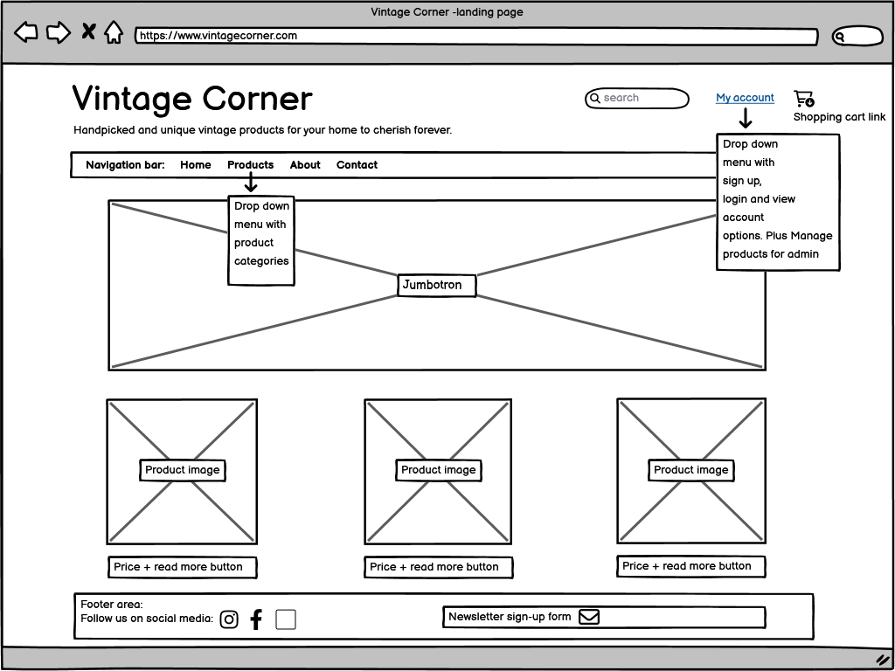
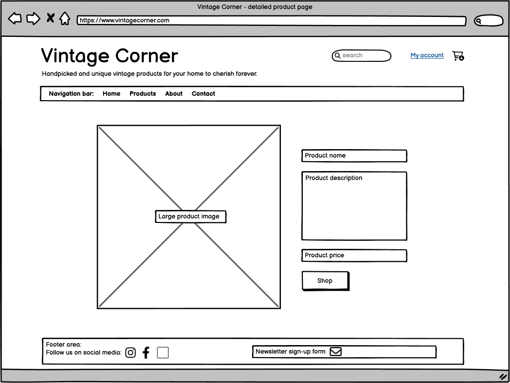
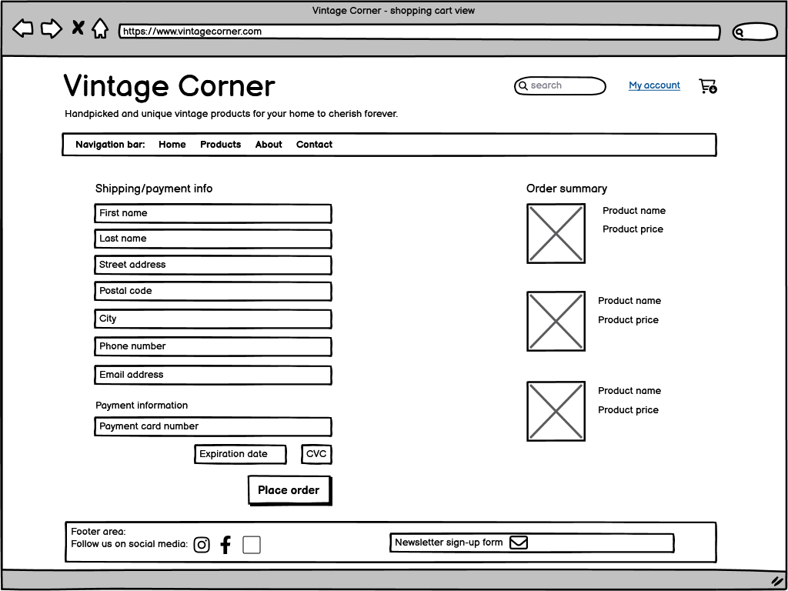
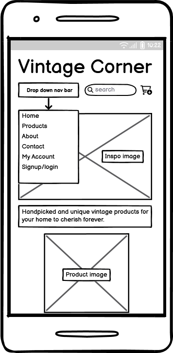
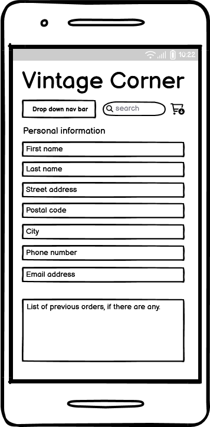
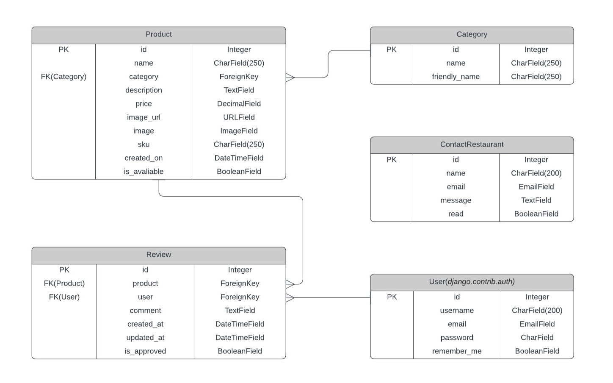

# Vintage Corner

Vintage Corner is an online store with a carefully selected assortment of vintage items for the home. Every piece is unique and in general there is only one copy of every item, but you might find multiple items in the same category. On the webpage the user can view all products avaliable at the moment, sort them into categories, or filter them in a preferred order. The user can also register for a personal account where they can view and update their personal information such as delivery address, view their order history and save their details for future orders. The user have full CRUD functionality to update their profile or manage their shopping cart before making a purchase. 

Vintage Corner is a Full Stack e-commerce store build with the help of the Django framework, and in addition the users CRUD functionality the site admin also have the option to add, edit or delete items directly in the browser interface. 

The live website can be seen [here](https://vintage-corner-9f26bce1e332.herokuapp.com/)

## Table of content
- [UX/UI Design](#uxui-design)
  - [User Stories](#user-stories)
  - [Wireframes](#wireframes)
  - [Colour scheme](#colour-scheme)
  - [Project Planning](#project-planning)
    - [Agile methodologies](#agile-methodologies)
    - [Database design](#database-design)
- [Features](#features)
  - [Existing features](#existing-features)
  - [Header](#header)
  - [Navigation menu](#navigation-menu)
  - [Landing page](#landing-page)
  - [Contact page](#contact-page)
  - [Register account/login page](#register-accountlogin-page)
  - [Footer](#footer)
  - [Potential future features](#potential-future-features)
- [Technologies used](#technologies-used)
  - [Languages](#languages)
  - [Database](#database)
  - [Frameworks](#frameworks)
  - [Libraries & Additional Programs/Software/Tools](#libraries--additional-programssoftwaretools)
- [Manual Testing](#manual-testing)
  - [Responsivness](#responsivness)
  - [Browser compability](#browser-compability)
  - [Validator testing](#validator-testing)
  - [User Story testing](#user-story-testing)
  - [Bugs](#bugs)
- [Deployment](#deployment)
  - [Forking](#forking)
  - [Cloning](#cloning)
  - [Deployment to Heroku](#deployment-to-heroku)
- [References/credit](#referencescredit)
  - [Content](#content)
  - [Media](#media)

## UX/UI Design

I wanted the website to have a sort of vintage feel, but at the same time a modern touchg in the styling to be a good representation of me. The colour scheme is mild and the main purpose is to enhance the product images and the UX. As usual I set out with a high amibiton to design something beautiful with a really good user interface, responsive modals and nice-looking forms to fill out - all with the help of a perfect Bootstrap grid system. Some of the things I set out to do I absolutely achieved, while some visual effects just didn't fit into the projects timeframe. As always it came down to focusing on the functionality within the different apps, and since there are quite a lot of them for this project, the layout was forced to take a step back. I had to make sure the authentication process worked, that the user profiles was connected to checkout view, that the orders went through and that the emails were sent - along with a thousand other details that need to be in place when building an e-commerce store. I do believe I have a good foundation to stand on with both the UX and the user interface, but there are absolutely room for improvement. 

### Colour scheme

The colour scheme and inspiration for the webpage actually came from a somewhat unexpected place - namely my shower curtain. Everytime I look at it I fall in love with the combination of colours, so I thought "why not" and used it as my inspiration for the colours of the page.

Below you can get a feel for the colour schema it inspired, and even though I didn't really have the time to follow it all the way through and had to lighten up some elements on the page due to readability, I think it's a really beautiful colour palett that works well with the vintage vibe. I will definitely come back to it when it's time to give some more love to the page and add on more of the colours to give the page some depth.

## User Stories

An agile approach was used to initialize the project - Epics to set the main structure for the user stories that needed to be written, and to make the project a little bit more approachable by bitesizing it. After the epics were set I wrote all the user stories and gave them labels to identify the must-haves, the should-haves, the could-haves and the wont-have - all in line with the MoSCoW prioritazion method. Every user story that I would work with then got some Acceptance Criterias and Tasks to make their purpose and what needed to be done even more clear. The final step of of the agile process was to give each user story a milestone label to help focus the work process even further. 

When it came down to the milestones I decided to divide them into 4 Iterations. User Stories concerning vital parts such as adding and viewing products, payment etc were part of the first iteration - and if I didn't finish them in the active iteration they would move into the next iteration, and something else had to be dropped or moved to another iteration. In real life I really see the value of working with iterations and I would have put a lot less "big" User Stories into each iteration for it to actually be realistic to manage. I would definitely not put so many vital parts in the first iteration ever again, but spread them out over the entire timeframe. In this scenario each iteration only lasted for two weeks and the timeframe continues on after my projects deadline - in a real worl project I would have split up each iteration into a 4 week period and as mentioned I would have made sure the vital functions was evenly distributed over all 4 iterations. But since we're working towards a hard deadline and with a short timeframe in this project, the Milestones are mainly there to show a more full circle approach to the agile way of working - but for the Vintage Corner project I don't really feel that they are applicable for the short amount of development time at my disposal.

I ended up with a total of 25 User Stories to work with in the end, the majority o them made it into Done section of my Kanban Board. Two of the User Stories containt criterias about the ability to choose size and quantity on an item, which I think are vital in general to an online store. But in this case they are not current since the store sells one of a kind pieces that don't come in different sizes, so those two User Stories won't make it out of the Todo-section. Another User Story that will remain in the Todo-section is the one about identifying deals and offers, since it's a Vintage store with handpicked items the sale-vibe doesnt't really fit i nline with the business model and the store customer. They are not on this site to make a bargain but to find something unique for their home. 

Below are the epics and the User Stories I ended up with. 

__EPIC:__ View products and navigation

- As a Site User I can view a list of all products on the site so that I can find items I might like to purchase.

- As a Site User I can view detailed information on a specific product so that I can read more about it and make an informed decision before purchasing it.

__EPIC:__ Search, sort and filter products

- As a Site User I can search for products by name or category so that I can easily find what I am looking for without having to look through all products on the site.

- As a Site User I can sort the products into given categories so that I can easily find the products I am interested in, without having to go through all products on the page.

- As a Site User I can add a filter to the list of all available products so that I can view products according to filters such as name, price, rating, news etc.

- As a Site User I can add a filter to the list of products in a specific category so that I can view products according to filters such as name, price, rating, news etc. in the specific category of my choice.

- As a Site User I can select the quantity of a product I would like to purchase so that I have the option to buy more than one of that specific item if I want to.

- As a Site User I can easily select the size of a product when required so that I don't purchase a product that doesn't fit.

- As a Site User I can easily identify deals and special offers on products so that I can buy products at the best possible price.

__EPIC:__ Registration and personal profile

- As a Site User I can register for an account so that I can login and view my order history, update my personal information etc.

- As a Site User I can login to my registered account and edit my user profile so that I can save my payment details, view my order history and easily update my delivery adress.

__EPIC:__ Administrate products on site

- As a Site Admin I can easily add new items to my online store so that the site is always up to date with available products for purchase.

- As a Site Admin I can edit and update the product details so that the price, description, image etc. are always correct and up to date.

- As a Site Admin I can delete a product from the site if they are no longer available so that the customers don't accidentally buy products that are not available.

__EPIC:__ Shopping cart

- As a Site User I can easily add products to my shopping cart so that I can purchase the products I am interested in.

- As a Site User I can easily access my shopping cart at any point so that I can view what products I've added so far and the total amount spent.

- As a Site User I can update the items in my shopping cart when viewing it so that I can update the quantity, size or remove the product before checkout.

__EPIC:__ Purchase and checkout

- As a new Site User I can easily enter my payment information so that I can check out quickly and smoothly.

- As a Site User I can sign in to my account to get my saved payment information so that i don't have to fill it out every time I make a purchase.

- As a Site User I can view an order confirmation after chechout so that I can verify that my order is correct.

- As a Site User I can receive an email order confirmation to my chosen email address after chechout so that I can control my order later without having to sign in to an account.

__EPIC:__ Reviews and newsletter

- As a Site User I can read ratings and reviews on products so that I can make an informed purchase decision.

- As a Site User I can rate and write a review about a product, or the website in general so that I can share my experience and help other customers make informed decisions.

- As a Site User I can subscribe to a newsletter so that I don't miss out on deals and offers, new products I might like etc.

- As a Site Admin I can send a newsletter to registered email adresses so that the customers know about new products, specila offers etc.

## Wireframes

Wireframes for both the mobile design and larger devices such as tablets and computers were made using [Balsamique](https://balsamiq.com/).

I really love the process of creating wireframes since you don't really take in limitations such as time and coding experience into the process - you just create what you like and end up with a couple of inspiring frames that you really strive to make a reality. Soem changes were made along the way due to issues with responsivness and some features not looking so great when coming to life - but mainly I stuck to the wireframes. 

As some might notice there are no wireframes for the reviews page, since this feature came about later in the project when I felt the need for more custom models and more interactive features on the site. I also missed to create a wireframe for the shopping cart, and went straight for the checkout view. Luckily there is a shopping cart view on the actual webpage.

Below are some examples of my wireframes:

The first wirefram shows the landing page with all its features such as header, navigation menu with drop-down options, the searchbar, the account icon with its drop-down options and the little shoppingcart. You can also see selected products below a large jumbotron featuring an image, and the footers content at the bottom. 

The wireframe for a detailed product page shows all the features I think are vital for the user - such as a product image, product name, a description of the product, the price and of course the option to actually put it into the shopping cart. 

I wanted the checkout view to containt two elements - a form to fill out all the delivery and pyament information, and a summary of the order so that the user can take one last look at it before they commit to the purchase. 

As mentioned all pages also got some mobile wireframes, for example the landing page is simply a responsive version of the one for larger screens, but here the products stack on top of each other and the navigation bar is an icon with drop-down functionality instead. 

Here is also the wireframe for the personal profile page where the user can update their personal information and view previous orders. 

There were 18 wireframes made in total, which can all be found [here](static/images/wireframes).

## Project planning

I started out with setting up pretty much the same file structure as the Boutique Ado project - since there are alot of apps and additional features when creating an e-commece store it's really easy to get lost somewhere in the many maaany folders and files. I did decide to go in a different direction with the static folders for CSS and JavaScript than what was made in the code along project - the Boutique Ado project had multiple folders with CSS-styling and js-files belonging to each app, but after a while I just felt that it made the structure more messy since I am the only one working on the project. I see the value when multiple people are involved, but in this project it just felt redundant.

Next part of the process was to tackle the User Stories so that I had something to achieve with each feature that was added to the page, more on that process below. After that the wireframes were created, and lastly the Entity Relationship Diagrams to plan the custom models that were needed were made.

After that I started building the actual e-commerce store, while at the same time I was figuring out how the Facebook page would look and drawing out some form of marketing strategy.

### Agile methodologies

- Kanban board - I used the Project Board in GitHub for the main planning of the Project. Issues were created as User Stories, with Acceptance Criterias belonging to each User Story. The User Stories were also assigned with tasks, to clarify for myself what each User Story demanded of me. As I love working on the design of a web page it's easy to put way to much time on that part, so the User Stories really help me to focus on the functionality of the project first and foremost.

- Epics - I really understand the value of Epics for large projects, to give the team a better overview of the projects User Stories and further prioritize the work process. I would have loved to work with even more Epics to break up the User Stories since I feel like some Epics are a little "heavy" with Stories (such as the Search, sort and filter products), but I had to move on to the next part of the planning so at that point I went with the Epics I had. 

- Milestones - Milestones were used as iterations and split the work into 4 iterations with its own Stories. I tried to evenly distribute the Stories so that each iteration would have pretty much the same amout of Stories - but if I would have added Story Points into the Agile mix I would have realized early on that some Stories in the first iterations would have demanded fewer Stories to accompany them in that specific iteration - there were simply to many demanding Storiews in the same iterations, as I talked about in the User Stories section above.

- MoSCoW Prioritization - The User Stories are labeled with one of the following four categories, all according to the MoSCow prioritization methodology:

  - Must Have: Features and requirements that are absolutely neccessary for the product to function and for the website to fulfill its purpose. These User Stories have the highest priority. 

  - Should Have: Important features that should be included if possible, but they are not critical for the website to function.

  - Could Have: Desirable features that can be added if there is enough time and resources.

  - Won’t Have: Features that will not be included in the project at this point, but might be a desirable feature in future development. 

 

### Database Design

The database design consists of a main project directory called vintage_corner, and then separate apps for pretty much every feature on the page. The About page is the only page on the site one that lives in the same app as a different template - due to the fact that it doesn't need any models, views etc of its own.

__Entity Relationship Diagrams(ERD)__

Tree custom models were made for this project - one for managing all Products in the store, one to handle the Contact form in the contact app, and one to manage Reviews. Many more models exist within the project but they all come from the Boutique Ado code along project, and are somewhat or not altered at all - many of them have gotten an extra field or two but don't feel altered enough to be called custom.

Below are the ERD's that were drawn out for the project. The User model is handled by the Django Framwork, but it plays an importanty role in my Review model since it has a one-to-many relationship - making sure signed in users can write many reviews connected to their one profile. The Review model also has a ForeignKey in the form of a product-field that is connected to the Product model, so that a user is able to write a review about a specific product that they have bought if they wish to.

I actually had a model for a response-function as well where users could write a response to a review that somebody else had written, but to many aspects weren't working at the time so I decided to skip it for now and save it for future development.

## Features

### Existing features

### Header

The header has quite a few elements in it, even though it looks pretty clean. It has the name of the store, a search bar to search for products, a navigation menu, a section for management of the users personal profile (plus product management for superusers) and a shopping cart that takes the user to a shopping cart view when clicked. The shopping cart is also always updated with the total amount spent so far during the user session, if the user has added items to their cart that is. At the moment the search bar only filters throught product-realed querys, but I would love to add functionality so that it searches through the entire page in the future. 

The mobile version containts pretty much the same features but presented in a responsive way, fitting into different screen sizes. 

### Navigation menu

The navigation menu consists of a built-in drop-down menu if the user wishes to look at a specific product category or simply view all products on the page. It also contains links to the About page, a Contact page and a reviews page if the user wishes to read what other users think about the webshop and the products.  

With the help of Bootstrap and some custom CSS styling the navigation menu becomes a drop down feature on smaller devices. Features such as My Account, Search and the Shopping cart icon are not part of the drop-down menu but are always visible as separate icons for good UX.

### Home page & Footer

The home page consist of only three sections apart from the header - a large jumbotron image to set the feeling for the user when they first land on the page, along with a big tagline that clarifies what the store is all about. Below that is a portion sized section of the all products view, where the user can get a quick look at the newest additions to the store - along and a button to redirect the user to a page where they can view all products in the store. Below those sections is the footer, which contains links to the stores social media, and a newsletter sign-up form for users who wish to opt-in on that. 

### Product list page

When navigation to the Products page the user has the option to either view all products on the site, or choose a specific category to filter out products. they also have the option to Sort the product list by either price, name or news.

 

### About page

The about page containts some general info about the company behind the store. It also provides the user with important links to Terms & Conditions, Privacy Policy, FAQ etc. I would have liked to put all of those important documents under its own headline in the navigation menu, but since time is of the esseence I had to settle with putting it all in one place for now. 

### Contact page

On the Contact page the user has the option to fill out a handy Contact Form if they want to get in touch with the store. The contact form is connencted to the Django admin panel so that the administrator can view incoming questions and inquiries from site users and reply to them. In line with a user friendly interface the site user gets an immediate respons validating that the message has been sent successfully, or if there are any errors in the field input when filling out the form. The respons is in form a Success-message generated with Bootstrap Toasts-messages, which are used throughout the site for information and validation. 

The contact form is responsive and user friendly on all screen sizes and devices. Error handling works as it should on both small and large screens.

 

### Review page

On the review page a site user can read reviews that have been written about the site in general, or about a product that they have previously bought. There is also the option to click a button and get redirected to a age where they can write a review of their own. In order to write a review the user must be registered and logged in to their account, so that the view can fetch information about the users previously bought products and display them in a list to the user. 

There is a lot of potential future features and developments that can be done to this page - I would love to have options for the user to edit or delete their reviews, write a response to somebody elses review and add images or videos to go along with their review - a user interaction like that would be gold for any site! But focus for now had to be on the functions that need to be in place for an online store, so content like this will have to wait. I am also not thrilled abot the design of the page, but again - function before style at this point. 

### Register for an account/sign in 

The user has the option to register for an account on the page, to be able to access their own personal profile page in the future. Or they can sign in to an existing account if they have already registered for one. Either way there's a possibility to do both in separate forms on the site - forms that got some styling with the help of Django Crispy Forms. Both forms contain password validation. 

### Personal profile page

On the personal profile page the user can view their saved delivery information, update the information if they want to, and view a list of previous orders - if they have any. 

### Shopping cart view

In the shopping cart the user have the ability to view the entire content of their shopping cart, and they have the option to remove items from the cart if they wish to. The total amount of the order is updated in real-time with user interactions, and so is the database. 

### Checkout view

In the checkout view the user gets a last look at their order in the form of an order summary so they have the option to go back and change it if they wish to. In the checkout view the user can also fill out a form with delivery information and provide the store with credit card information to finalize the purchase. Here the user can opt in to save their personal information to their 

error handling

toast succes with order number

### Potential future features

## SEO/Meta optimization

Searched different vintage stores online to see what keywords they use, 

quite hard since many companies load in tags from companies so they cannot be viewed in the head when you use DevTools

also learned about the social media meta tags

meta keys will be updated according to what items are in the shop

## Business model 

Business Model Canvas

## Facebook page

You can view the page at: [Vintage Corner Facebook page](https://www.facebook.com/vintage.corner.eshop/)

## The customer 

- who is he/she? 

since its a curated vintage assortment we don't want to market the page through sales and deals and big adverts - that's not the core of store and its products. The store is for ... so the approach is to build a long term relationship with the customers,

get them engaged in shopping travels, get them to discuss their products in social media and forums, organic growth, spread the word via satisfied customers - a slow strategy in line with the assortment of products. 

SEO

image names alt attribute on images hosted on site, rel attribute noopener on social media links, add links to info page about vintage cvameras because customers are nerds

länka mellan olika sidor för att keep user on the page

## Technologies used

### Languages
- HTML5
- CSS3
- JavaScript
- Python

### Database
- CI Database URL (Postgres) - used to store all data.

### Frameworks
Django - main framework for a secure and resuable development process.

### Libraries & Additional Programs/Software/Tools
- Bootstrap - used for some of the front-end design. Mainly to make the page responsive and make use of Bootstraps grid system. It was accompanied by some custom CSS since I'm not all that familiar with Bootstraps many fuctions and add ons just yet.
- Balsamique - used to create all wireframes for the project
- Django All Auth - used for user registration and authentication
- Django Crispy Forms - used for all forms on the page, mainly to control their behaviour and give them the same look for a good UX
- Django Summernote - used as the editor for the Admin panel
- dj-database-url - used to connect Django to database via URL
- Favicon - used for finding a tab icon, which also became part of the logo for the restaruant project
- Font Awesome - used for social media icons 
- GitHub - used to store all the code and the Projects Kanban board
- GitPod - used as the IDE during development
- Google Fonts - used for custom fonts on the entire page
- Gunicorn - used as the server to run Python code/Django on Heroku platform
- Heroku - used as the platform to deploy the project
- Lucidchart - used to create the Entity Relationship Diagrams, also known as ERD
- Pexels - used to find suiting images for all pages of the site
- Psycopg - PostgreSQL adapter for Python
- Whitenoice - used to handle the static files for deployment

Images are hosted in the projects static directory for this project, but in the future I want to work Cloudinary.

## Manual testing

The manual testing consisted of not only the things listed below, but the testing also meant asking everybody I know to test the website and all its functions - such as 

### Responsivness 

Mainly thanks to Bootstrap the page is responsive on all devices - from mobile phones to tablets, laptops and larger screens. It reaches a max-width on larger devices as to not look to stretched out and looks alright on even the smallest mobile screens. I've asked friends and family to try it out on different devices to get as many opinions in as possible. 

### Browser compability

The project has been tested on different browsers such as: Google Chrome, Safari, Microsoft Edge and Mozilla Firefox. It looks and functions pretty much the same on all browsers. 

### Validator testing

- HTML - through the official W3C validator. 

- CSS - through the official Jigsaw validator. No issues came back when i ran the code through the CSS validator. 

- JavaScript - the JavaScript check in JSHint came back with 

- Python - PEP8 Python Validator

There were quite a few files to run throught the PEP8 validator, somewhere around 70 since there are a lot of apps. 

When testing the page using Lighthouse for Chrome, 

### User Story testing

The User Story testing has been performed throughout the development. When building the site I moved the Stories I was working on into the "In Progress" column on my Kanban-board, and then checked that every acceptance criteria and task was fulfilled before moving it into the "Done" column. As you can see there are still Stories left in the "In progress" column, due to the fact that some criterias have been met, but not all of them. The project is still functional but I don't want to move them into the Done column until the criterias are fully met. 

Along with the User Stories regarding some admin features, there are stories about a review page that haven't made it out of the "Todo" column yet. These are really good Stories to work with in the future 

### Bugs

## Deployment

This project was deployed using Heroku.

### Forking

- Navigate to the GitHub repository.
- On the top right hand side, click the button named "Fork".
- A new page named "Create new Fork" will open up, where you can choose to edit hte name of the project.
- Click on "Create Fork" at the bottom of the page. 
- Now a copy of the project will appear in your list of repositories.

### Cloning

- Navigate to the GitHub repository.
- Click on the "Code" tab at the top of the repository and copy the URL for web that appears. 
- Open up the terminal in a code editor of your choice and change the current working directory to a new one you will use to clone the repository. 
- Type in "git clone" in the terminal, paste in the copied URL and press "Enter".

### Deployment to Heroku

1. Create and set up the Heroku app
- Login to your Heroku account and navigate to the dashboard.
- Click on the "New"-button to create a new app.
- Give the app a unique name.

2. Ready your code for deployment in your Code Editor.
- Install a production ready webserver for Heroku such as gunicorn by writing the following command in your terminal: pip3 install gunicorn~=20.1.0.
- Add gunicorn==20.1.0 to the requirements.txt file with the following command in your terminal: pip3 freeze --local > requirements.txt.
- Create a file called Procfile in the root directory of your project.
- Inside the Procfile declare that the web process followed by the command to execute your Django project: web: gunicorn yourprojectsname.wsgi
- Open the projects settings.py file an set DEBUG=False
- In settings.py add '.herokuapp.com' to the ALLOWED_HOSTS list.
- Git add, git commit and git push to GitHub so that all files are up to date in your repository.

3. Ready your database for deployment
- Create an env.py file and add the following:
import os
os.environ.setdefault( "DATABASE_URL", "")
os.environ.setdefault("SECRET_KEY", "your__secret_key")
- Check to se that your env.py file is added to the .gitignore file. 
- Make sure your settings.py has this code in it: SECRET_KEY = os.environ.get("SECRET_KEY").
- Click on the "Settings" tab and navigate to the "Reveal Config Vars" section. 
- Add a SECRET_KEY value to Herokus Config Vars.

4. Deployment with static files
- Install Python package for whitenoise with the command: pip3 install whitenoise==6.7.0
- Add whitenoise to your requirements.txt file with the command: pip3 freeze --local > requirements.txt
- Add 'whitenoise.middleware.WhiteNoiseMiddleware' to the list of MIDDLEWARE in settings.py below Django SecurityMiddleware.
- In settings.py add a path to staticfiles in this way: STATIC_ROOT = os.path.join(BASE_DIR, 'staticfiles')
- Run python3 manage.py collectstatic in the terminal to collect the static files and when asked to choose yes or no, type "yes" in the terminal.
- Check what Python version is used in your development environment and look up the supported runtime closest to your Python version. 
- Create a runtime.txt file in your apps root directory and add the Python version from the list of supported runtimes, in a format like this: python-3.12.5.

4. Deploy on Heroku
- Click on the "Deploy" tab on your Heroku Dashboard.
- Under the "Deploy method" section choose to Connect to GitHub, depending on earlier access you might be asked to authenticate using GitHub.
- Choose the projects repository in the list that apperas when you start to type in the search box. 
- Start a manual deployment of the main branch by scrolling to the bottom of the Deploy-page and click on "Deploy branch".
- Click "Open app" to view your deployed project. 
- Open the "Resources" tab and switch to Eco Dyno to keep the project up and running. 

## References/credit

### Content

The Code Institute code along project "Boutique Ado" has been extremly helpful when it comes to setting up the structure for the project and I have returned to it again and agian throughout the development to make sure i use the right commands, deploy in the right way and so on. 
The models we worked with in that project was of course inspiration for when designing my own 

As always [Stack Overflow](https://stackoverflow.com/) has been my go to place everytime I've googled a piece of code for troubleshooting. 

Product info mainly from Wikipedia

### Media

[Pexels.com](https://www.pexels.com/)
[Unsplash.com](https://unsplash.com/)
[Favicon](https://favicon.io/emoji-favicons/)
https://imagecolorpicker.com/